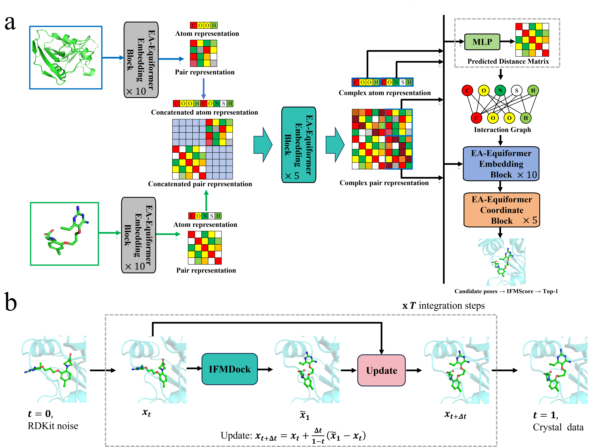

<h1 align="center">
   MPFDock
</h1>

<h4 align="center">Equivariant Flow Matching for Molecular Docking Guided by Ligand–Protein Interactions
</h4>


<h2 align="center">
  
</h2>


**IFMDock** generates ligand poses in a rigid protein pocket with Cartesian flow-matching models. The included **IFMScore** model ranks the resulting poses.

## Environment

The dependencies in `requirements.txt` follow the local `IFMDock` environment (Python 3.10, PyTorch 2.7.0 with CUDA 12.8). For the same GPU setup, install PyTorch and its PyTorch Geometric extensions first:

```bash
conda create -n ifmdock python=3.10 -y
conda activate ifmdock
pip install torch==2.7.0 torchvision==0.22.0 torchaudio==2.7.0 --index-url https://download.pytorch.org/whl/cu128
pip install torch_cluster==1.6.3 torch_scatter==2.1.2 torch_sparse==0.6.18 torch_spline_conv==1.2.2 -f https://data.pyg.org/whl/torch-2.7.0+cu128.html
pip install -r requirements.txt
pip install -e .
```

Use PyTorch and PyG wheels appropriate for your CUDA version if it differs from CUDA 12.8. The docking models are in `checkpoints/model1.pt` and `checkpoints/model2.pt`; the matching configurations are `model1.yml` and `model2.yml`. IFMScore uses `IFMScore/trained_models/ifmscore.pth`.

## Data

### Training dataset

Obtain [PDBBind v2020 from PDBBind+](https://www.pdbbind-plus.org.cn/download) under its data terms and arrange one directory per complex. The [older EquiBind preprocessed archive](https://zenodo.org/records/6408497) is no longer available because of PDBBind licensing. For inference, the same layout applies. Each directory needs the crystal ligand and receptor before preprocessing:

```text
data/pdbbind/<id>/
├── <id>_ligand.sdf
└── <id>_protein.pdb
```

Prepare the cleaned receptor, 256-atom pocket and docking grid:

```bash
python scripts/preprocess/prepare_dataset.py data/pdbbind --report data/prepare_report.csv
```

For training, build graph caches and deterministic train/validation lists after the distance caches are ready:

```bash
python scripts/preprocess/prepare_training_data.py \
  --dataset data/pdbbind --cache data/cache --split-dir data/splits
```

### Test datasets

- [PoseBusters Benchmark v1](https://zenodo.org/records/8278563): protein–ligand structures for docking evaluation; [PoseBusters code](https://github.com/maabuu/posebusters) provides geometry checks.
- [DeepDockingDare](https://github.com/DSDD-UCPH/DeepDockingDare): an additional docking benchmark.

Convert the chosen test set to the per-complex layout above and prepare the required inputs before docking. The directories `example/5SB2/` and `example/5SD5/` contain two local structure examples; they also need the same preparation.

## Training

The training configurations are `configs/train.yaml`. Their data paths assume `data/pdbbind`, `data/cache` and `data/splits`. Set `IFMDOCK_GPUS` to the GPUs available on your machine:

```bash
IFMDOCK_GPUS=0 bash scripts/train/train.sh
```


## Inference

Run both models and rank the sampled poses with IFMScore:

```bash
scripts/inference/run_pipeline.sh data/pdbbind --gpus 0
```

The pipeline uses 40 poses and 15 integration steps by default. It writes each complex to `output/<id>/`: `gen_<id>_ligand.sdf` contains poses sorted by IFMScore, and `<id>_ligand.sdf` and `<id>_protein.pdb` are copies of the crystal structures. Evaluation summaries are written at the output root. PoseBusters reports geometry checks without filtering or repairing poses. An optional output directory can be supplied as the second positional argument.

## Scoring

Score an existing SDF or MOL2 pose file independently with the included IFMScore checkpoint:

```bash
python IFMScore/score.py \
  --protein example/5SB2/5SB2_protein.pdb \
  --ligand example/5SB2/5SB2_ligand.sdf \
  --output 5SB2_scores.csv
```

The protein may be a prepared pocket PDB. The CSV contains a score for each pose; higher scores rank first.

## Evaluation metrics

```bash
python scripts/evaluation/benchmark_metrics.py output --posebusters --geometry-jsd > metrics.json
```

RMSD is calculated on heavy atoms in the protein coordinate frame, taking the lowest value over matching ligand atom symmetries without aligning the generated pose to the crystal. Top-1 is the first IFMScore-ranked pose; Best-1 is the pose with the lowest RMSD. Their success rates are the fractions of complexes with RMSD ≤ 2 Å. **MRSR** is the fraction of complexes whose *mean RMSD across generated poses* is ≤ 2 Å. **PB-Valid** requires all PoseBusters docking checks to pass for the selected pose; the script also reports the joint RMSD-success and PB-Valid rates.

The optional geometry JSD compares the Top-1 generated and crystal distributions of bond lengths, bond angles and dihedral angles. Values are pooled by local chemical type across complexes, estimated with a Gaussian KDE on a shared grid, and compared using SciPy's Jensen–Shannon **distance** (the square root of mathematical JS divergence).

## License

See `LICENSE` for IFMDock.
